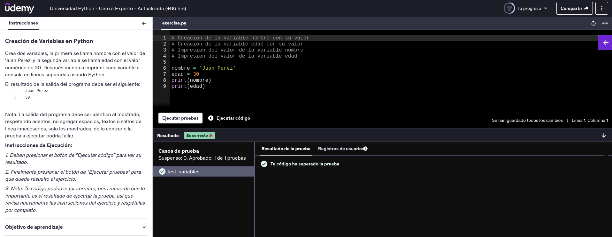

# 📊 Variables y la Memoria RAM

En **Python**, cada vez que creamos una variable y le asignamos un valor, estamos reservando espacio en la memoria **RAM** (_Random Access Memory_), también conocida como memoria de corto plazo.

---

## 🚀 Ejemplo Práctico

```python
edad = 30
altura = 1.75

edad = 32


🧠 Explicación Detallada

    Asignación Inicial de Variables:
        edad = 30 → Se crea un objeto int con el valor 30 en la memoria RAM.
        altura = 1.75 → Se crea un objeto float con el valor 1.75 en la memoria RAM.

    Reasignación de Variable:
        edad = 32 → La referencia al valor anterior (30) se elimina.
        La variable edad ahora apunta a un nuevo objeto int con el valor 32.

    ⚡ Nota: En Python, cuando se reasigna un valor a una variable, el objeto anterior en memoria puede quedar sin referencia y ser eliminado por el recolector de basura.
```

## 🗂️ Representación en Memoria

| **Variable** | **Valor** | **Tipo de Dato** | **Dirección de Memoria** |
| :----------: | :-------: | :--------------: | :----------------------: |
|    `edad`    |   `32`    |      `int`       |         `0x555`          |
| _(liberado)_ |   `30`    |      `int`       |         `0x333`          |
|   `altura`   |  `1.75`   |     `float`      |         `0x444`          |

##########################################################

---

# 📝 Reglas en Nombres de Variables

Al definir variables en **Python**, es importante seguir ciertas reglas para evitar errores.

## ✅ Reglas Básicas

- **Letras, dígitos y guiones bajos:**  
  Los nombres de variables pueden tener letras (mayúsculas o minúsculas), dígitos y guiones bajos (`_`).  
  Ejemplo: `mi_variable`, `usuario1`, `nombre_completo`.

- **No comenzar con dígitos:**  
  El nombre de una variable **NO** puede comenzar con un número.  
  ❌ Incorrecto: `1edad`  
  ✅ Correcto: `edad1`

- **Sin palabras reservadas:**  
  No se pueden usar palabras reservadas del lenguaje (keywords) como nombres de variables.  
  Ejemplos de palabras reservadas: `for`, `if`, `class`, `try`, etc.

- **Sensibilidad a mayúsculas y minúsculas:**  
  Python diferencia entre mayúsculas y minúsculas.  
  Ejemplo: `mi_nombre` es distinto de `Mi_nombre`.

---

# 🚀 Convenciones y Buenas Prácticas

Además de las reglas básicas, es recomendable seguir buenas prácticas para mejorar la legibilidad del código.

## 🔑 Convenciones

- **`snake_case`:**  
  Se recomienda usar la notación _snake_case_, es decir, palabras en minúsculas separadas por guiones bajos (`_`).  
  Ejemplos: `nombre_usuario`, `nombre_completo`.

- **Nombres descriptivos:**  
  Los nombres de las variables deben reflejar su contenido.  
  ❌ No usar: `e`  
  ✅ Mejor usar: `edad`  
  ❌ No usar: `n`  
  ✅ Mejor usar: `nombre`

- **Evitar nombres de un solo carácter:**  
  A menos que sea en bucles o contextos muy específicos, evita usar nombres de un solo carácter ya que no son descriptivos y pueden ser confusos.  
  ❌ Ejemplo confuso: `x = 5`  
  ✅ Ejemplo claro: `contador = 5`

---

## 📢 Resumen Final

- Sigue las **reglas básicas** para evitar errores de sintaxis.
- Aplica **buenas prácticas** para mejorar la legibilidad de tu código.
- Recuerda que un buen nombre de variable hace que tu código sea más fácil de entender y mantener.

---

##########################################################

---

# 📦 Tipos de Datos en Python

Python es un lenguaje de **tipado dinámico**, lo que significa que no es necesario indicar el tipo de la variable al momento de declararla. El tipo de dato se asigna automáticamente en función del valor que se le asigna.

## 🔢 Tipos Numéricos

- **Números Enteros (`int`):**  
  Representan números sin parte decimal.  
  Ejemplos: `42`, `-109`

- **Números con Punto Flotante (`float`):**  
  Representan números con parte decimal.  
  Ejemplos: `3.1416`, `-0.001`

---

## ✏️ Cadenas de Texto

- **Cadenas de Texto (`str`):**  
  Secuencia de caracteres, utilizada para almacenar texto.  
  Ejemplo: `'Hola Mundo'`

---

## 🔍 Tipos Lógicos

- **Booleanos (`bool`):**  
  Almacenan un valor lógico de **verdadero** (`True`) o **falso** (`False`).  
  Se usan para controlar el flujo de programas mediante condicionales.  
  Ejemplo: `es_mayor = True`

---

## 🚫 Valor Nulo

- **`None`:**  
  Es un tipo especial en Python que representa la **ausencia de valor**.  
  Ejemplo:

  ```python
  resultado = None

  ## 📊 Resumen de Tipos de Datos
  ```

| **Tipo de Dato** | **Descripción**              |    **Ejemplo**     |
| :--------------- | :--------------------------- | :----------------: |
| `int`            | Números enteros              |    `42`, `-109`    |
| `float`          | Números con punto flotante   | `3.1416`, `-0.001` |
| `str`            | Cadenas de texto             |   `'Hola Mundo'`   |
| `bool`           | Valores booleanos (lógicos)  |  `True`, `False`   |
| `NoneType`       | Representa ausencia de valor |       `None`       |

### ✅ **Detalles Clave:**

- **Secciones bien definidas:** Para una lectura más fluida.
- **Ejemplos de código:** En formato Python para mayor claridad.
- **Tabla resumen:** Para sintetizar la información de forma visual.
- **Notas destacadas:** Que ayudan a reforzar conceptos importantes.

---

# Ejercicio

---

# 🏨 Sistema de Reserva de Hoteles

Crea un sistema de reserva de hoteles que contenga la siguiente información de una reserva:

## 📋 Información de la Reserva

- **Nombre del cliente** 🧑
- **Días de estancia** 📅
- **Tarifa diaria** 💲
- **Indicar si el cuarto tiene vista al mar** 🌊 (valor booleano: `True` o `False`)

---

## 🖨️ Requisitos

1. Capturar la información de la reserva.
2. Imprimir los valores de cada variable en un formato estructurado.
3. Realizar algunos cambios en los datos y volver a imprimir la información actualizada.

---

## 💡 Ejemplo de Salida Esperada

```plaintext
*** Sistema de Reserva de Hoteles ***
Cliente: Laura Martínez
Días de estancia: 5
Tarifa diaria: 1200.0
Habitación con vista al mar? True

```
# Constantes en Python

A diferencia de otros lenguajes de programación, en Python no existe un tipo específico para definir una constante de manera estricta. **Sólo es una convención.**

Python no impide cambiar el valor de una variable, pero podemos seguir la siguiente convención de declarar el nombre de una variable en mayúsculas y con ello indicamos que el valor de esta variable **NO debe modificarse** una vez inicializada. Es decir, esta variable se debe tratar como una constante.

## Sintaxis para una constante

```python
# Sintaxis para una constante
NOMBRE_CONSTANTE = valor

Ejemplos de constantes

PI = 3.14159
MENSAJE_ERROR = 'Usuario Inválido'
NOMBRE_USUARIO_VALIDO = 'admin'


```
